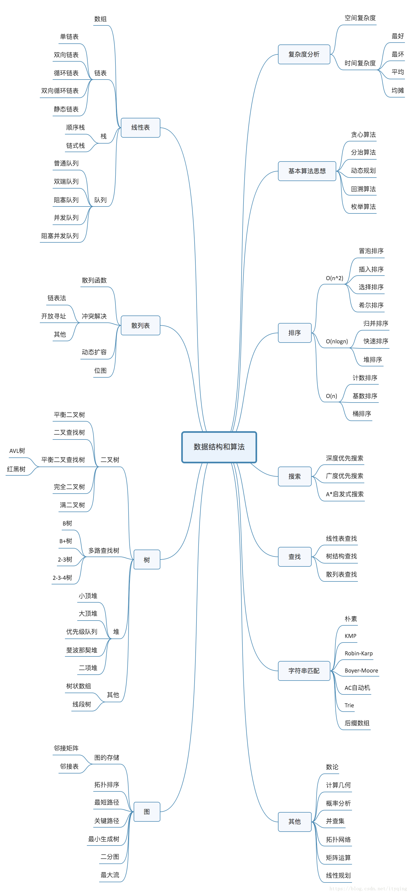

# readme

- 解决方案配置，常规输出

  ```shell
  输出目录
  $(SolutionDir)build\$(ProjectName)\$(ConfigurationName)\$(PlatformTarget)\link
  中间目录
  $(SolutionDir)build\$(ProjectName)\$(ConfigurationName)\$(PlatformTarget)\compile
  配置类型
  （Project1为dll）
  （Project2为exe）
  ```

  


- 自动dll导出

  使用由工写的export_header.py脚本自动导出，项目中在project1中的链接前事件

  ```
  $(SolutionDir)tools\python3-embed\python.exe $(SolutionDir)tools\export_header.py  $(ProjectName)
  使用内置python写法，确保安装了python3
  python $(SolutionDir)tools\export_header.py  $(ProjectName)
  ```

### 项目配置

| 1. 添加工程的头文件目录：        | 工程---属性---配置属性---c/c++---常规---附加包含目录：加上头文件存放目录。 |
| -------------------------------- | ------------------------------------------------------------ |
| 2. 添加文件引用的lib静态库路径： | 工程---属性---配置属性---链接器---常规---附加库目录：加上lib文件存放目录。 |
| 3. 然后添加工程引用的lib文件名： | 工程---属性---配置属性---链接器---输入---附加依赖项：加上lib文件名。 |
| 4. 添加工程引用的dll动态库：     | 工程---属性---配置属性---调试---环境，格式为 PATH=dll所在目录 |

  


  插图
  